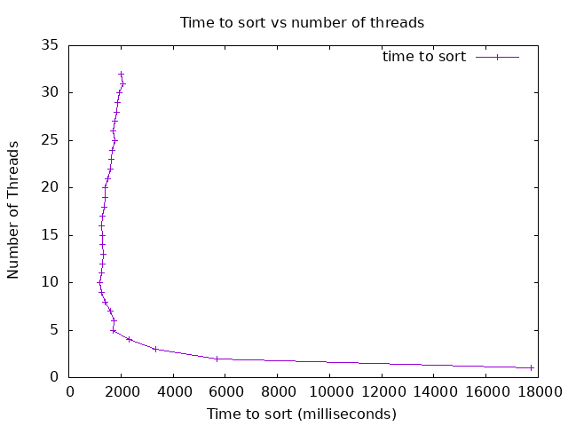

## Analysis

Were you able to generate something close to what the example showed?
Why or why not.
The graph I got is pretty close to what the example showed, Though in my example,
1 thread took a lot longer (18 seconds) to run than in the example, but in mine
it got to less than 2 seconds after 5 threads compared to the example where it took
until 8 threads before it got less than 2 seconds. I think it was pretty close since
my implementation must be a decent way of implementing a thread safe merge sort. Of course,
one thread on my implementation takes about 18 seconds compared to the example that takes
about 12 seconds, so there could be some of the base code that could potentially be touched up.
Though in consideration it does become under 2 seconds with 5 threads, making a bit less threads
more efficient than the example graph shows. Though my best result was 10 threads while the example
was 9, so I am not sure how important my 5 threads as being faster compared to the 5 threads in the
example.

Did you see a slow down at some point why or why not?
So it initially started very slow, and then sped up before it started to slow down after
10-15 threads, becoming less efficient but still staying around 2 seconds. It slows down
because at some point a certain amount of threads become unnecessary. Just like how having
too many workers at a job could take up to much space and reduce efficiency. One example is
at my server/bartending job where there are usually two bartenders scheduled per shift. If 
a third person hops behind the bar they would just end up being in the way since there isn't 
enough space and drinks could end up being made more slowly.

Did your program run faster and faster when you added more threads?
Why or why not?
It definitely ran faster, with 1 thread it took 18 seconds to run, but even after just
adding another thread it jumped the time down to just under 6 seconds. This makes sense
because the sort is divided concurrently and the threads don't bump into each other.
If me and a couple of my coworkers are tasked to clean popcorn machines at a movie theater
and 3 of them are dirty, then it makes sense to have 3 people doing it. Otherwise it can
only be cleaned one at a time. Same way of how 3 threads can do 3 different pieces of the
task at the same time, leading to a faster result.

What was the optimum number of threads for your machine?
The most optimum number of threads was 10 for about 1.2 seconds, based on the average of
running the program itself on 10 threads.

What was the slowest number of threads for your machine?
The slowest number of threads was 1 thread at a total of 18 seconds, second slowest being 2 threads
at about 5.7 seconds.
